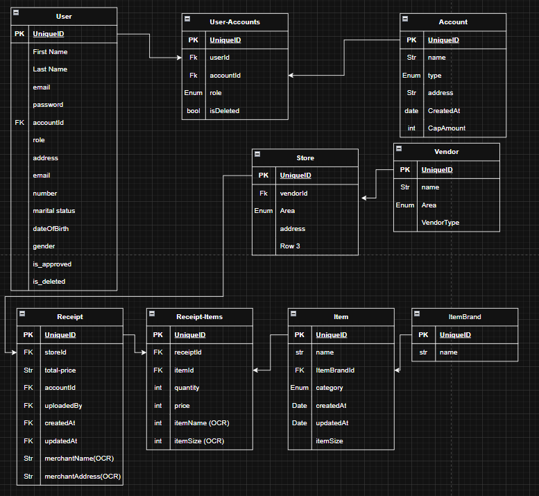

# _Butler App_

A financial management system.

## Description

Butler is a financial app, that is built for people to manage their financials but it is more place based.
So Someone can have an account for his (Home - Organization) by entering his expenses monthly (focusing more on homes) and getting
on it analytics by the end of the month, and each account is independent from the others. Butler is all centered around the receipts reader scanner, where whenever a user buys sth he can scan it to record his expenses.

## Reports

- Monthly expense report that showcase his spendings, and yearly where he sees what are the months he has highest.
- Top 10 Products bought through the month to track where his money is spent

## Special Features

- Receipt Scanner that takes a receipts photo and extract his spendings from
- Recommendation on less priced products to buys and offers by shops.
- Financial aid assist by collaborating with banks to provide Non-interest Loans
- User can put cap for spending and will get alerts during the month when exceeded
  -Tips for how to better save his money during the month based on his past data.

## Tech Stack

- Nodejs (Typescript), Express.
- PostgreSQL
- Docker
-

# Installation

## Install dependencies

- `npm install`

## Create the database (PostgreSQL)

- Run this query `createdb butler-db`

## Create Enviroment variables file and fill with you db credentials

- `cp sample.env .env`

## Generate Prisma Client

- `npm run prisma:gen`

## Run Database Migrations

- `npm run prisma:migrate`

## Start the server

- `npm run dev`

## Available scripts

- `npm run dev` # Start development server
- `npm run build` # Compile TypeScript
- `npm start` # Run compiled app
- `npm run lint` # Run ESLint
- `npm test` # Run tests
- `npm run test:watch` # Run tests in watch mode
- `npm run prisma:gen` # Generate Prisma client
- `npm run prisma:migrate` # Run Prisma migrations

## Database Design

- N.B. some fields may have been added in the code, but entities themselves are not changed
  

## Usage
